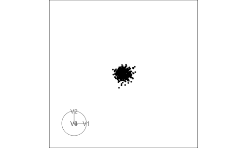
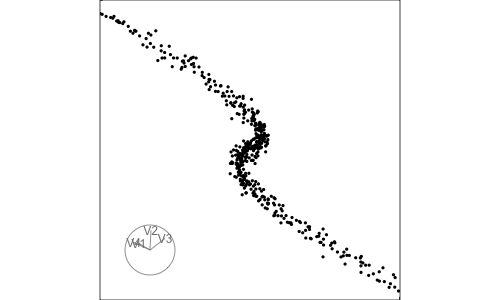
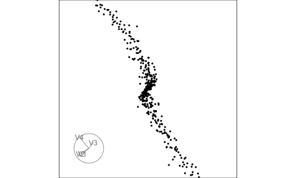
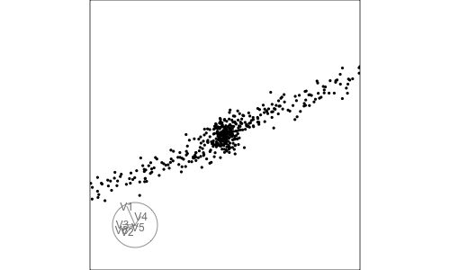
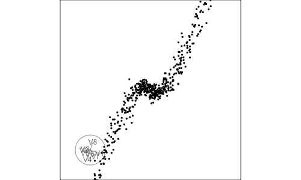
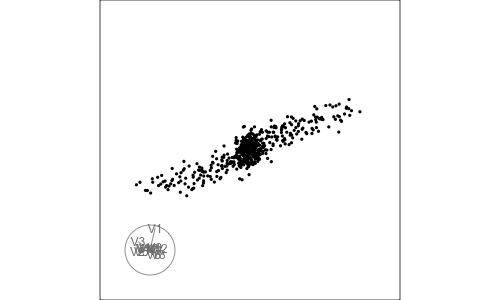

## Overview


The `skinny` scagnostic measures how thin or elongated a two-dimensional point cloud is. Large values are assigned to patterns that form narrow, linear, or filament-like structures with relatively little spread perpendicular to the main direction. This makes `skinny` a potential projection pursuit index for guiding a tour toward thin or elongated structures hidden in high-dimensional data.

This vignette demonstrates how to:

- construct a four-dimensional dataset containing a hidden polynomial structure;
- compare the index value of the known signal and noise projections;
- use `skinny` with several guided-tour optimizers; and
- examine how the Jellyfish optimizer behaves as the number of noise dimensions increases.

The examples use both the original index and a rescaled version that reduces values likely to arise from Gaussian noise.


```{r}
library(tourr)
library(cassowaryr)
library(spinebil)
library(dplyr)
library(tidyr)
library(purrr)
library(ggplot2)
library(knitr)
```

## Generate a four-dimensional dataset

The example dataset contains four variables. Variables `V1` and `V2` are Gaussian noise. Variables `V3` and `V4` contain the true structure.

A quadratic polynomial is used to create a clear string-like pattern:

-   `V3` is a linear coordinate along the curve,
-   `V4` is a sinusoidal function of `V3`.

The data are not standardized in this example so that the signal remains dominant relative to the noise variables. Standardizing all variables to unit variance would change this relative signal-to-noise magnitude and may alter the projection found by the optimizer.

```{r}
set.seed(1050)

n <- 500
t <- seq(-2, 2, length.out = n)

poly_signal <- poly(t, degree = 3, raw = TRUE)

skinny4_raw <- data.frame(
  V1 = rnorm(n, sd = 0.15),                       
  V2 = rnorm(n, sd = 0.15),                     
  V3 = poly_signal[, 1] + rnorm(n, sd = 0.01),  
  V4 = poly_signal[, 3] + rnorm(n, sd = 0.02)
)

skinny4 <- as.matrix(skinny4_raw)

```

## Define the true structure and a noise projection

-   The **true structured projection** is the plane spanned by `V3` and `V4`.
-   The **noise projection** is the plane spanned by `V1` and `V2`.

```{r}
basis_true <- spinebil::basis_matrix(3, 4, 4)
basis_noise <- spinebil::basis_matrix(1, 2, 4)
```

## Plot the signal and noise projections

The signal and noise projections are shown side by side to define the target structure that the guided tour should recover.

```{r}
plot_projection <- bind_rows(
  tibble(
    x = skinny4[, 1],
    y = skinny4[, 2],
    projection = "noise: V1 and V2"
  ),
  tibble(
    x = skinny4[, 3],
    y = skinny4[, 4],
    projection = "signal: V3 and V4"
  )
)

ggplot(plot_projection, aes(x = x, y = y)) +
  geom_point(size = 0.7, alpha = 0.7) +
  facet_wrap(~ projection, nrow = 1, scales = "free") +
  theme_bw() +
  theme(
    aspect.ratio = 1,
    axis.text = element_blank(),
    axis.ticks = element_blank()
  ) +
  labs(
    x = NULL,
    y = NULL,
    title = "Noise and signal projections"
  )
```

The right panel contains the true stringy structure. The left panel contains only noise.

## Explore the data with a grand tour

A grand tour rotates through many two-dimensional projections of the four-dimensional data. It provides an initial visual check that the hidden structure is present and visible from suitable projection angles before an index-guided search is applied.

### Run and save the grand tour

```{r eval=FALSE}

render_gif(
  data = skinny4,
  tour_path = grand_tour(),
  display = display_xy(
    axes = "bottomleft",
    center = TRUE,
    half_range = 3,
    pch = 16,
    cex = 0.6
  ),
  frames = 500,
  gif_file = "skinny4_grand_tour.gif",
  width = 500, 
  height = 300
)
```

```{r}

```

The grand tour provides an unguided view of the projection space. The guided tour can then use `skinny` to search specifically for projections with thin structure.


## Define `skinny` as a projection pursuit index

Two versions of the index are defined:

- a **raw** `skinny` index; and
- a **rescaled** version.

The rescaled version uses the estimated Gaussian-noise threshold

$$
\ell(n)=0.72-0.19\log(n)+0.02\{\log(n)\}^2,
$$

and maps values likely to arise from Gaussian noise toward zero.

```{r}
rescale_skinny <- function(z, n) {
  lb <- 0.72 - 0.19 * log(n) + 0.02 * (log(n)^2)
  pmax(0, (z - lb) / (1 - lb))
}

skinny_index <- function(rescale = FALSE) {
  function(mat) {

    z <- cassowaryr::sc_skinny(mat[, 1], mat[, 2])

    if (rescale) {
      z <- rescale_skinny(z, nrow(mat))
    }

    z
  }
}

skinny_index_raw <- skinny_index(rescale = FALSE)
skinny_index_rescaled <- skinny_index(rescale = TRUE)
```


## Check `skinny` on the true structure and on noise

Before optimization, the index is evaluated directly on the known signal and noise planes.

```{r}
direct_check <- tibble(
  projection = c("true structure: V3-V4", "noise: V1-V2"),
  raw_skinny = c(
    skinny_index_raw(skinny4 %*% basis_true),
    skinny_index_raw(skinny4 %*% basis_noise)
  ),
  rescaled_skinny = c(
    skinny_index_rescaled(skinny4 %*% basis_true),
    skinny_index_rescaled(skinny4 %*% basis_noise)
  )
)

knitr::kable(
  direct_check,
  digits = 3,
  caption = "Raw and rescaled skinny values for the true structured projection and a noise projection."
)
```


The structured projection should receive a substantially larger value than the noise projection. In this example, the rescaling maps the noise value to zero while retaining a large value for the signal.

## Guided tour using `search_geodesic`

The first guided tour uses the default optimizer, `search_geodesic`, with the rescaled `skinny` index.

```{r, eval=FALSE}
set.seed(1050)

hist_geodesic <- save_history(
  data = skinny4,
  tour_path = guided_tour(
    index_f = skinny_index_rescaled,
    search_f = search_geodesic,
    max.tries = 100,
    alpha = 0.8,
    cooling = 0.995
  ),
  max_bases = 100,
  sphere = FALSE,
  rescale = FALSE
)

saveRDS(hist_geodesic, "hist_geodesic.rds")
```

### View the `search_geodesic` tour interactively

```{r eval=FALSE}

render_gif(
  data = skinny4,
  tour_path = planned_tour(hist_geodesic),
  display = display_xy(
    axes = "bottomleft",
    center = TRUE,
    half_range = 3,
    pch = 16,
    cex = 0.6
  ),
  frames = 200,
  gif_file = "skinny4_guided_geodesic.gif",
  width = 500, 
  height = 300
  
)
```

```{r}

```

The animation can be used to assess whether the guided tour moves toward the hidden polynomial structure in variables `V3` and `V4`. 

## Guided tour using `search_better_random`

The `search_better_random` optimizer provides a more exploratory alternative to the default geodesic search. This can be useful when a scagnostic index produces an irregular optimization surface or several local optima.

```{r, eval=FALSE}
set.seed(1050)

hist_better_random <- save_history(
  data = skinny4,
  tour_path = guided_tour(
    index_f = skinny_index_rescaled,
    search_f = search_better_random,
    max.tries = 100,
    alpha = 0.8,
    cooling = 0.995
  ),
  max_bases = 100
)

saveRDS(hist_better_random, "hist_better_random.rds")
```

### Save the `search_better_random` tour as a gif

```{r eval=FALSE}

render_gif(
  data = skinny4,
  tour_path = planned_tour(hist_better_random),
  display = display_xy(
    axes = "bottomleft",
    center = TRUE,
    half_range = 3,
    pch = 16,
    cex = 0.6
  ),
  frames = 200,
  gif_file = "skinny4_guided_better_random.gif",
  width = 500, 
  height = 300
  
)
```


```{r}

```

Comparing the two animations shows whether either optimizer recovers the polynomial structure more clearly or more consistently.


## Guided tour using `search_jellyfish`

The Jellyfish optimizer starts from multiple candidate bases, so the returned object contains several search loops. Each loop represents one path through projection space.

Jellyfish is first applied to the four-dimensional polynomial dataset and the returned search history is saved.

```{r eval=FALSE}
set.seed(1050)

jellyfish_res <- animate_xy(
  skinny4,
  guided_tour(
    index_f = skinny_index_rescaled,
    search_f = search_jellyfish
  )
)

saveRDS(jellyfish_res, "jellyfish_res.rds")
```

## Find the best Jellyfish projection

The projection with the **largest index value** is selected across all Jellyfish loops and iterations.

The loop containing the maximum index value is extracted and replayed. The loop number is determined from the result rather than fixed in advance.

```{r}
jellyfish_res <- readRDS("jellyfish_res.rds")

best_jelly <- jellyfish_res |>
  filter(!is.na(index_val)) |>
  slice_max(index_val, n = 1, with_ties = FALSE)

best_jelly
```

Extract the best loop and its sequence of bases:

```{r}
best_loop <- best_jelly$loop
best_loop
```

```{r}
bases_best_loop <- jellyfish_res |>
  filter(loop == best_loop) |>
  arrange(tries) |>
  pull(basis) |>
  check_dup(0.1)
```

Only the loop containing the best projection is replayed.

## Save and show the best Jellyfish loop

```{r eval=FALSE}
render_gif(
  data = skinny4,
  tour_path = planned_tour(bases_best_loop),
  display = display_xy(
    axes = "bottomleft",
    center = TRUE,
    half_range = 3,
    pch = 16,
    cex = 0.6
  ),
  frames = 200,
  gif_file = "skinny4_jellyfish_best_loop.gif",
  width = 500,
  height = 300
)
```

```{r}

```

## Visualize the best final projection

The exact best basis can also be extracted and used to plot the corresponding projection directly.

```{r}
best_basis <- best_jelly$basis[[1]]

best_projection <- as.data.frame(skinny4 %*% best_basis)
colnames(best_projection) <- c("x", "y")

ggplot(best_projection, aes(x = x, y = y)) +
  geom_point(size = 0.7, alpha = 0.7) +
  coord_equal() +
  theme_bw() +
  theme(
    aspect.ratio = 1,
    axis.text = element_blank(),
    axis.ticks = element_blank()
  ) +
  labs(
    x = NULL,
    y = NULL,
    title = "Best projection found by Jellyfish",
    subtitle = paste0(
      "Best loop = ", best_loop,
      ", tries = ", best_jelly$tries,
      ", skinny = ", round(best_jelly$index_val, 3)
    )
  )
```

The maximum index value found by Jellyfish is:

```{r}
best_jelly$index_val
```

Jellyfish can be useful for scagnostic indices because their optimization surfaces may be irregular or contain local optima. Exploring several candidate paths increases the opportunity to locate a projection with a large index value, although it does not guarantee recovery of the global optimum.


## Extend the example to higher dimensions

The number of noise variables is increased to examine whether Jellyfish can still recover the hidden polynomial structure. In each dataset, the final two variables contain the signal and all preceding variables contain Gaussian noise.


```{r}
make_poly_data <- function(n = 500, p = 6, seed = 1050) {
  set.seed(seed)

  t <- seq(-2, 2, length.out = n)

  poly_signal <- poly(t, degree = 3, raw = TRUE)

  poly_data <- matrix(
    rnorm(n * p, sd = 0.15),
    nrow = n,
    ncol = p
  )

  poly_data[, p - 1] <- poly_signal[, 1] + rnorm(n, sd = 0.01)
  poly_data[, p] <- poly_signal[, 3] + rnorm(n, sd = 0.02)

  colnames(poly_data) <- paste0("V", seq_len(p))

  poly_data
}
```

Generate the datasets:

```{r}
poly6 <- make_poly_data(n = 500, p = 6, seed = 1050)
poly8 <- make_poly_data(n = 500, p = 8, seed = 1050)
poly12 <- make_poly_data(n = 500, p = 12, seed = 1050)
```

## Define true signal and noise bases

```{r}
basis6_true <- spinebil::basis_matrix(5, 6, 6)
basis8_true <- spinebil::basis_matrix(7, 8, 8)
basis12_true <- spinebil::basis_matrix(11, 12, 12)

basis6_noise <- spinebil::basis_matrix(1, 2, 6)
basis8_noise <- spinebil::basis_matrix(1, 2, 8)
basis12_noise <- spinebil::basis_matrix(1, 2, 12)
```

## Check the index value on the true 2D projection

Before running Jellyfish, the index is evaluated on the known signal and noise projections.

```{r}
poly_direct_check <- tibble(
  data = c("poly6", "poly8", "poly12"),
  true_projection = c(
    skinny_index_rescaled(poly6 %*% basis6_true),
    skinny_index_rescaled(poly8 %*% basis8_true),
    skinny_index_rescaled(poly12 %*% basis12_true)
  ),
  noise_projection = c(
    skinny_index_rescaled(poly6 %*% basis6_noise),
    skinny_index_rescaled(poly8 %*% basis8_noise),
    skinny_index_rescaled(poly12 %*% basis12_noise)
  )
)

knitr::kable(poly_direct_check, digits = 3)
```

A large value for the known signal projection confirms that the index recognizes the target structure. If the optimizer does not recover a comparable projection, the limitation is more likely related to search difficulty than to the index definition itself.


## Run Jellyfish in higher dimensions

The same search procedure is applied to the six-, eight-, and twelve-dimensional datasets.

```{r, eval=FALSE}
set.seed(1050)

poly6_jelly <- animate_xy(
  poly6,
  guided_tour(
    index_f = skinny_index_rescaled,
    search_f = search_jellyfish
  )
)

saveRDS(poly6_jelly, "poly6_jelly.rds")
```

```{r, eval=FALSE}
set.seed(1050)

poly8_jelly <- animate_xy(
  poly8,
  guided_tour(
    index_f = skinny_index_rescaled,
    search_f = search_jellyfish
  )
)

saveRDS(poly8_jelly, "poly8_jelly.rds")
```

```{r, eval=FALSE}
set.seed(1050)

poly12_jelly <- animate_xy(
  poly12,
  guided_tour(
    index_f = skinny_index_rescaled,
    search_f = search_jellyfish
  )
)

saveRDS(poly12_jelly, "poly12_jelly.rds")
```

Read the saved results:

```{r}
poly6_jelly <- readRDS("poly6_jelly.rds")
poly8_jelly <- readRDS("poly8_jelly.rds")
poly12_jelly <- readRDS("poly12_jelly.rds")
```

## Find the best Jellyfish projection in each dataset

```{r}
best_poly6 <- poly6_jelly |>
  slice_max(index_val, n = 1, with_ties = FALSE)

best_poly8 <- poly8_jelly |>
  slice_max(index_val, n = 1, with_ties = FALSE)

best_poly12 <- poly12_jelly |>
  slice_max(index_val, n = 1, with_ties = FALSE)
```

Summarize the best values:

```{r}
best_poly_summary <- tibble(
  data = c("poly6", "poly8", "poly12"),
  best_loop = c(best_poly6$loop, best_poly8$loop, best_poly12$loop),
  tries = c(best_poly6$tries, best_poly8$tries, best_poly12$tries),
  max_index_val = c(best_poly6$index_val, best_poly8$index_val, best_poly12$index_val)
)

knitr::kable(best_poly_summary, digits = 3)
```

## Extract the best loop from each search

```{r}
bases_poly6_best <- poly6_jelly |>
  filter(loop == best_poly6$loop) |>
  arrange(tries) |>
  pull(basis) |>
  check_dup(0.1)

bases_poly8_best <- poly8_jelly |>
  filter(loop == best_poly8$loop) |>
  arrange(tries) |>
  pull(basis) |>
  check_dup(0.1)

bases_poly12_best <- poly12_jelly |>
  filter(loop == best_poly12$loop) |>
  arrange(tries) |>
  pull(basis) |>
  check_dup(0.1)
```

## Render the best Jellyfish loops

### 6D polynomial data

```{r eval=FALSE}
render_gif(
  data = poly6,
  tour_path = planned_tour(bases_poly6_best),
  display = display_xy(
    axes = "bottomleft",
    center = TRUE,
    half_range = 3,
    pch = 16,
    cex = 0.6
  ),
  frames = 200,
  gif_file = "poly6_jellyfish_best.gif",
  width = 500,
  height = 300
)
```

```{r}

```

### 8D polynomial data

```{r eval=FALSE}
render_gif(
  data = poly8,
  tour_path = planned_tour(bases_poly8_best),
  display = display_xy(
    axes = "bottomleft",
    center = TRUE,
    half_range = 3,
    pch = 16,
    cex = 0.6
  ),
  frames = 200,
  gif_file = "poly8_jellyfish_best.gif",
  width = 500,
  height = 300
)
```

```{r}

```

### 12D polynomial data

```{r eval=FALSE}
render_gif(
  data = poly12,
  tour_path = planned_tour(bases_poly12_best),
  display = display_xy(
    axes = "bottomleft",
    center = TRUE,
    half_range = 3,
    pch = 16,
    cex = 0.6
  ),
  frames = 200,
  gif_file = "poly12_jellyfish_best.gif",
  width = 500,
  height = 300
)
```

```{r}

```

## Plot the best final projections

```{r}
plot_best_proj <- function(data, best_row, title_text) {
  best_basis <- best_row$basis[[1]]

  proj <- as.data.frame(as.matrix(data) %*% best_basis)
  colnames(proj) <- c("x", "y")

  ggplot(proj, aes(x = x, y = y)) +
    geom_point(size = 0.6, alpha = 0.7) +
    coord_equal() +
    theme_bw() +
    theme(
      aspect.ratio = 1,
      axis.text = element_blank(),
      axis.ticks = element_blank()
    ) +
    labs(
      x = NULL,
      y = NULL,
      title = title_text,
      subtitle = paste0(
        "best loop = ", best_row$loop,
        ", tries = ", best_row$tries,
        ", skinny = ", round(best_row$index_val, 3)
      )
    )
}
```

```{r}
plot_best_proj(poly6, best_poly6, "Best Jellyfish projection for 6D polynomial data")
```

```{r}
plot_best_proj(poly8, best_poly8, "Best Jellyfish projection for 8D polynomial data")
```

```{r}
plot_best_proj(poly12, best_poly12, "Best Jellyfish projection for 12D polynomial data")
```


## Summary

The `skinny` index assigns large values to the known polynomial projection and substantially smaller values to a Gaussian-noise projection. The rescaled version further suppresses index values that are likely to arise from noise, making it a practical choice for the guided-tour examples presented in this vignette.

The optimizer remains an important component of the analysis. `search_geodesic`, `search_better_random`, and `search_jellyfish` explore projection space differently and may therefore identify different projections. Jellyfish performs a broader search by exploring multiple candidate paths simultaneously, although locating the optimal projection becomes increasingly difficult as the dimensionality of the data increases.

As with other projection pursuit indices, scaling should be considered carefully. Standardizing all variables changes their relative contribution to the projection pursuit search and may alter the optimization landscape. Consequently, the projection identified by the optimizer can differ depending on whether the data are standardized before analysis.


