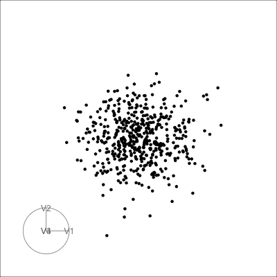
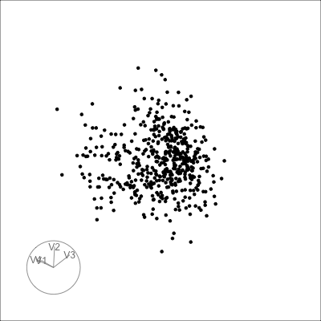
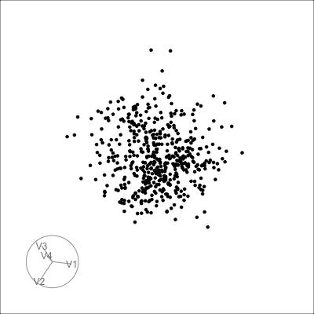
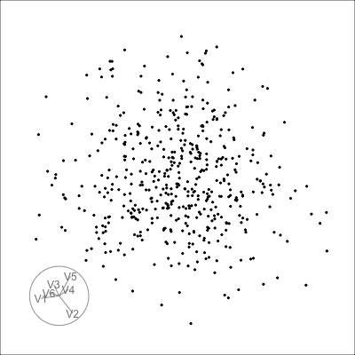
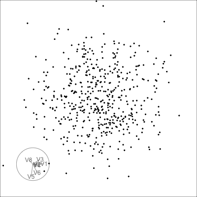
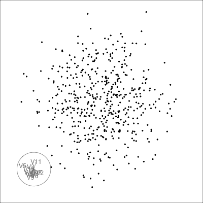
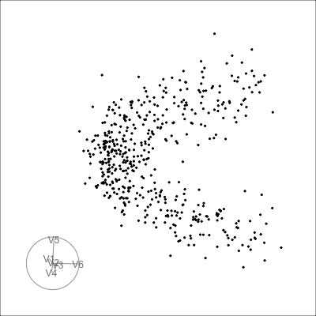

## Overview

The `stringy05` scagnostic measures string-like or snake-like structure in a two-dimensional point cloud. Patterns receiving large values may include chains, curved paths, and polynomial or sine-wave-like relationships. This makes `stringy05` a potential projection pursuit index for guiding a tour toward nonlinear structures hidden in high-dimensional data.

This vignette demonstrates how to:

- construct a four-dimensional dataset containing a hidden polynomial structure;
- compare the index value of the known signal and noise projections;
- use `stringy05` with several guided-tour optimizers; and
- examine how the Jellyfish optimizer behaves as the number of noise dimensions increases.

The examples use both the original index and a rescaled version that reduces values likely to arise from Gaussian noise.

```{r}
library(tourr)
library(cassowaryr)
library(spinebil)
library(dplyr)
library(tidyr)
library(purrr)
library(ggplot2)
library(knitr)
library(patchwork)
library(purrr)
```

## Generate a four-dimensional dataset

The example dataset contains four variables. Variables `V1` and `V2` are Gaussian noise, while variables `V3` and `V4` contain the underlying quadratic structure.

A quadratic polynomial is used to create a clear string-like pattern:

* `V3` represents the linear coordinate along the curve,
* `V4` represents the quadratic component of the curve.

After generating the data, only the structural variables, `V3` and `V4`, are rescaled so that their means and standard deviations match those of the noise variables. The noise variables remain unchanged. This removes differences in location and scale between the signal and noise variables while preserving the quadratic relationship between `V3` and `V4`. As a result, the optimizer must identify the projection based on the geometric structure rather than relying on the signal variables having a larger variance than the noise variables.

```{r}
set.seed(1050)

n <- 500
t <- seq(-2, 2, length.out = n)

poly_signal <- poly(t, degree = 2, raw = TRUE)

stringy4_raw <- data.frame(
  V1 = rnorm(n, sd = 0.15),                       
  V2 = rnorm(n, sd = 0.15),                     
  V3 = poly_signal[, 1] + rnorm(n, sd = 0.01),  
  V4 = poly_signal[, 2] + rnorm(n, sd = 0.02)
)

match_mean_sd <- function(x, target) {
  (x - mean(x)) / sd(x) * sd(target) + mean(target)
}

stringy4_raw$V3 <- match_mean_sd(
  stringy4_raw$V3,
  stringy4_raw$V1
)

stringy4_raw$V4 <- match_mean_sd(
  stringy4_raw$V4,
  stringy4_raw$V2
)

stringy4 <- as.matrix(stringy4_raw)

# colMeans(stringy4_raw)
# sapply(stringy4_raw, sd)

```


## Define the true structure and a noise projection

-   The **true structured projection** is the plane spanned by `V3` and `V4`.
-   The **noise projection** is the plane spanned by `V1` and `V2`.

```{r}
basis_true <- spinebil::basis_matrix(3, 4, 4)
basis_noise <- spinebil::basis_matrix(1, 2, 4)
```

## Plot the signal and noise projections

The signal and noise projections are shown side by side to define the target structure that the guided tour should recover.

```{r}
#| fig-align: center
plot_projection <- bind_rows(
  tibble(
    x = stringy4[, 1],
    y = stringy4[, 2],
    projection = "noise: V1 and V2"
  ),
  tibble(
    x = stringy4[, 3],
    y = stringy4[, 4],
    projection = "signal: V3 and V4"
  )
)

ggplot(plot_projection, aes(x = x, y = y)) +
  geom_point(size = 0.7, alpha = 0.7) +
  facet_wrap(~ projection, nrow = 1, scales = "free") +
  theme_bw() +
  theme(
    aspect.ratio = 1,
    axis.text = element_blank(),
    axis.ticks = element_blank()
  ) +
  labs(
    x = NULL,
    y = NULL,
    title = "Noise and signal projections"
  )
```

The right panel contains the true stringy structure. The left panel contains only noise.

## Explore the data with a grand tour

A grand tour rotates through many two-dimensional projections of the four-dimensional data. It provides an initial visual check that the hidden structure is present and visible from suitable projection angles before an index-guided search is applied.

### Run and save the grand tour

```{r eval=FALSE}

render_gif(
  data = stringy4,
  tour_path = grand_tour(),
  display = display_xy(
    axes = "bottomleft",
    center = TRUE,
    half_range = 0.8
  ),
  frames = 500,
  gif_file = "stringy4_grand_tour.gif",
  width = 400, 
  height = 400
)
```

```{r}
#| fig-align: center

```

The grand tour provides an unguided view of the projection space. The guided tour can then use `stringy05` to search specifically for projections with string-like structure.

## Define and check `stringy05` as a projection pursuit index 

```{r}
# Define the index
rescale_stringy05 <- function(z, n) {
  lb <- 0.05 + 3.86 / sqrt(n)
  pmax(0, (z - lb) / (1 - lb))
}

stringy05_raw <- function(rescale = FALSE) {
  function(mat) {
    z <- cassowaryr::sc_stringy05(mat[, 1], mat[, 2])

    if (rescale) {
      z <- rescale_stringy05(z, nrow(mat))
    }

    z
  }
}


stringy05_index_raw <- stringy05_raw(rescale = FALSE)
stringy05_index_rescaled <- stringy05_raw(rescale = TRUE)
```

Before optimization, the index is evaluated directly on the known signal and noise planes.

```{r}
direct_check <- tibble(
  projection = c("true structure: V3-V4", "noise: V1-V2"),
  stringy05_values = c(
    stringy05_index_rescaled(stringy4 %*% basis_true),
    stringy05_index_rescaled(stringy4 %*% basis_noise)
  )
)

knitr::kable(
  direct_check,
  digits = 3,
  align = "c",
  caption = "stringy05 values for the true structured projection and a noise projection."
)
```


## Guided tour using `search_geodesic`

The first guided tour uses the default optimizer, `search_geodesic`, with the rescaled `stringy05` index.

```{r, eval=FALSE}
set.seed(1050)

hist_geodesic <- save_history(
  data = stringy4,
  tour_path = guided_tour(
    index_f = stringy05_index_rescaled,
    search_f = search_geodesic,
    max.tries = 100,
    alpha = 0.8,
    cooling = 0.995
  ),
  max_bases = 100,
  sphere = FALSE,
  rescale = FALSE
)

saveRDS(hist_geodesic, "hist_geodesic.rds")
```

### View the `search_geodesic` tour interactively

```{r eval=FALSE}

render_gif(
  data = stringy4,
  tour_path = planned_tour(hist_geodesic),
  display = display_xy(
    axes = "bottomleft",
    center = TRUE,
    half_range = 0.8
  ),
  frames = 500,
  gif_file = "stringy4_guided_geodesic.gif",
  width = 400, 
  height = 400
  
)
```

```{r}
#| fig-align: center

```

The animation can be used to assess whether the guided tour moves toward the hidden polynomial structure in variables `V3` and `V4`. 

## Guided tour using `search_better_random`

The `search_better_random` optimizer provides a more exploratory alternative to the default geodesic search. This can be useful when a scagnostic index produces an irregular optimization surface or several local optima.

```{r, eval=FALSE}
set.seed(1050)

hist_better_random <- save_history(
  data = stringy4,
  tour_path = guided_tour(
    index_f = stringy05_index_rescaled,
    search_f = search_better_random,
    max.tries = 100,
    alpha = 0.8,
    cooling = 0.995
  ),
  max_bases = 100
)

saveRDS(hist_better_random, "hist_better_random.rds")
```

### Save the `search_better_random` tour as a gif

```{r eval=FALSE}

render_gif(
  data = stringy4,
  tour_path = planned_tour(hist_better_random),
  display = display_xy(
    axes = "bottomleft",
    center = TRUE,
    half_range = 0.8
  ),
  frames = 500,
  gif_file = "stringy4_guided_better_random.gif",
  width = 400, 
  height = 400
  
)
```


```{r}
#| fig-align: center

```

Comparing the two animations shows whether either optimizer recovers the polynomial structure more clearly or more consistently.

## Guided tour using `search_jellyfish`

Unlike local search methods, the Jellyfish optimizer begins from multiple candidate projection bases (jellies), with each jelly exploring projection space independently. The returned object therefore contains multiple search loops, where each loop represents one path through projection space.


To increase the likelihood of finding the global optimum, the optimizer is run with **40 jellies** and **40 maximum search iterations** per jelly. Increasing the number of jellies allows the algorithm to explore a wider range of starting projections, while increasing `max.tries` gives each jelly more opportunities to refine its search toward a higher projection pursuit index.

The Jellyfish search is first applied to the four-dimensional polynomial dataset, and the resulting search history is saved for later visualization and analysis.


```{r eval=FALSE}
set.seed(1050)

jellyfish_res <- animate_xy(
  stringy4,
  guided_tour(
    index_f = stringy05_index_rescaled,
    search_f = search_jellyfish,
    n_jellies = 40,
    max.tries = 40
  )
)

saveRDS(jellyfish_res, "jellyfish_res.rds")
```

## Find the best Jellyfish projection

The projection with the **largest index value** is selected across all Jellyfish loops and iterations.

The loop containing the maximum index value is extracted and replayed. The loop number is determined from the result rather than fixed in advance.

```{r}
jellyfish_res <- readRDS("jellyfish_res.rds")


best_loop <- jellyfish_res |> ferrn::get_best() |> pull(loop)

```

Extract the best loop and its sequence of bases:

```{r}
bases_best_loop <- jellyfish_res |>
  filter(loop == best_loop) |>
  pull(basis) |> 
  check_dup(0.1)

```


Only the loop containing the best projection is replayed.

## Save and show the best Jellyfish loop

```{r eval=FALSE}
render_gif(
  data = stringy4,
  tour_path = planned_tour(bases_best_loop),
  display = display_xy(
    axes = "bottomleft",
    center = TRUE,
    half_range = 0.8
  ),
  frames = 500,
  gif_file = "stringy4_jellyfish_best_loop.gif",
  width = 400,
  height = 400
)

```

```{r}
#| fig-align: center

```

## Visualize the best final projection

The exact best basis can also be extracted and used to plot the corresponding projection directly.

```{r}
best_jelly <-  jellyfish_res |> ferrn::get_best()
best_basis <- best_jelly$basis[[1]]

best_projection <- as.data.frame(stringy4 %*% best_basis)
colnames(best_projection) <- c("x", "y")

ggplot(best_projection, aes(x = x, y = y)) +
  geom_point(size = 0.7, alpha = 0.7) +
  coord_equal() +
  theme_bw() +
  theme(
    aspect.ratio = 1,
    axis.text = element_blank(),
    axis.ticks = element_blank()
  ) +
  labs(
    x = NULL,
    y = NULL,
    title = "Best projection found by Jellyfish",
    subtitle = paste0(
      "Best loop = ", best_loop,
      ", tries = ", best_jelly$tries,
      ", stringy05 = ", round(best_jelly$index_val, 3)
    )
  )
```

The maximum index value found by Jellyfish is:

```{r}
best_jelly$index_val
```


Jellyfish can be useful for scagnostic indices because their optimization surfaces may be irregular or contain local optima. Exploring several candidate paths increases the opportunity to locate a projection with a large index value, although it does not guarantee recovery of the global optimum.


## Extend the example to higher dimensions

The number of noise variables is increased to examine whether Jellyfish can still recover the hidden polynomial structure. In each dataset, the final two variables contain the signal and all preceding variables contain Gaussian noise.


Generate the datasets:

```{r}
match_mean_sd <- function(x, target) {
  (x - mean(x)) / sd(x) * sd(target) + mean(target)
}

make_poly_data <- function(n = 500, p = 6, seed = 1050) {

  set.seed(seed)

  t <- seq(-2, 2, length.out = n)
  poly_signal <- poly(t, degree = 2, raw = TRUE)

  # Same structural variables for every p
  signal_1 <- poly_signal[, 1] + rnorm(n, sd = 0.01)
  signal_2 <- poly_signal[, 2] + rnorm(n, sd = 0.02)

  # Noise variables
  noise <- matrix(
    rnorm(n * (p - 2), sd = 0.15),
    nrow = n,
    ncol = p - 2
  )

  # Match the structural variables to the noise distribution
  target <- as.vector(noise)

  signal_1 <- match_mean_sd(signal_1, target)
  signal_2 <- match_mean_sd(signal_2, target)

  poly_data <- cbind(
    noise,
    signal_1,
    signal_2
  )

  colnames(poly_data) <- paste0("V", seq_len(p))

  poly_data
}

poly6  <- make_poly_data(n = 500, p = 6, seed = 1050)
poly8  <- make_poly_data(n = 500, p = 8, seed = 1050)
poly12 <- make_poly_data(n = 500, p = 12, seed = 1050)
```


## Define true signal and noise bases

```{r}
basis6_true <- spinebil::basis_matrix(5, 6, 6)
basis8_true <- spinebil::basis_matrix(7, 8, 8)
basis12_true <- spinebil::basis_matrix(11, 12, 12)

basis6_noise <- spinebil::basis_matrix(1, 2, 6)
basis8_noise <- spinebil::basis_matrix(1, 2, 8)
basis12_noise <- spinebil::basis_matrix(1, 2, 12)
```

## Check the index value on the true 2D projection

Before running Jellyfish, the index is evaluated on the known signal and noise projections.

```{r}
poly_direct_check <- tibble(
  data = c("poly6", "poly8", "poly12"),
  true_projection = c(
    stringy05_index_rescaled(poly6 %*% basis6_true),
    stringy05_index_rescaled(poly8 %*% basis8_true),
    stringy05_index_rescaled(poly12 %*% basis12_true)
  ),
  noise_projection = c(
    stringy05_index_rescaled(poly6 %*% basis6_noise),
    stringy05_index_rescaled(poly8 %*% basis8_noise),
    stringy05_index_rescaled(poly12 %*% basis12_noise)
  )
)

knitr::kable(poly_direct_check, digits = 3)
```

A large value for the known signal projection confirms that the index recognizes the target structure. If the optimizer does not recover a comparable projection, the limitation is more likely related to search difficulty than to the index definition itself.


## Run Jellyfish in higher dimensions

The same search procedure is applied to the six-, eight-, and twelve-dimensional datasets.

```{r, eval=FALSE}
set.seed(1050)

poly6_jelly <- animate_xy(
  poly6,
  guided_tour(
    index_f = stringy05_index_rescaled,
    search_f = search_jellyfish,
    n_jellies = 40,
    max.tries = 40
  )
)

saveRDS(poly6_jelly, "poly6_jelly.rds")
```

```{r, eval=FALSE}
set.seed(1050)

poly8_jelly <- animate_xy(
  poly8,
  guided_tour(
    index_f = stringy05_index_rescaled,
    search_f = search_jellyfish,
    n_jellies = 40,
    max.tries = 40
  )
)

saveRDS(poly8_jelly, "poly8_jelly.rds")
```

```{r, eval=FALSE}
set.seed(1050)

poly12_jelly <- animate_xy(
  poly12,
  guided_tour(
    index_f = stringy05_index_rescaled,
    search_f = search_jellyfish,
    n_jellies = 40,
    max.tries = 40
  )
)

saveRDS(poly12_jelly, "poly12_jelly.rds")
```

Read the saved results:

```{r}
poly6_jelly <- readRDS("poly6_jelly.rds")
poly8_jelly <- readRDS("poly8_jelly.rds")
poly12_jelly <- readRDS("poly12_jelly.rds")
```

## Find the best Jellyfish projection in each dataset

```{r}


best_poly6 <- poly6_jelly |> ferrn::get_best()

best_poly8 <- poly8_jelly |> ferrn::get_best()

best_poly12 <- poly12_jelly |> ferrn::get_best()
```

Summarize the best values:

```{r}
best_poly_summary <- tibble(
  data = c("poly6", "poly8", "poly12"),
  best_loop = c(best_poly6$loop, best_poly8$loop, best_poly12$loop),
  tries = c(best_poly6$tries, best_poly8$tries, best_poly12$tries),
  max_index_val = c(best_poly6$index_val, best_poly8$index_val, best_poly12$index_val)
)

knitr::kable(best_poly_summary, digits = 3)
```

## Extract the best loop from each search

```{r}
bases_poly6_best <- poly6_jelly |>
  filter(loop == best_poly6$loop) |>
  arrange(tries) |>
  pull(basis) |>
  check_dup(0.1)

bases_poly8_best <- poly8_jelly |>
  filter(loop == best_poly8$loop) |>
  arrange(tries) |>
  pull(basis) |>
  check_dup(0.1)

bases_poly12_best <- poly12_jelly |>
  filter(loop == best_poly12$loop) |>
  arrange(tries) |>
  pull(basis) |>
  check_dup(0.1)
```

## Render the best Jellyfish loops

### 6D polynomial data

```{r eval=FALSE}
render_gif(
  data = poly6,
  tour_path = planned_tour(bases_poly6_best),
  display = display_xy(
    axes = "bottomleft",
    center = TRUE,
    half_range = 0.5,
    cex = 0.6
  ),
  frames = 500,
  gif_file = "poly6_jellyfish_best.gif",
  width = 400,
  height = 400
)
```

```{r}
#| fig-align: center

```

### 8D polynomial data

```{r eval=FALSE}
render_gif(
  data = poly8,
  tour_path = planned_tour(bases_poly8_best),
  display = display_xy(
    axes = "bottomleft",
    center = TRUE,
    half_range = 0.5,
    cex = 0.6
  ),
  frames = 500,
  gif_file = "poly8_jellyfish_best.gif",
  width = 400,
  height = 400
)
```

```{r}
#| fig-align: center

```

### 12D polynomial data

```{r eval=FALSE}
render_gif(
  data = poly12,
  tour_path = planned_tour(bases_poly12_best),
  display = display_xy(
    axes = "bottomleft",
    center = TRUE,
    half_range = 0.5,
    cex = 0.6
  ),
  frames = 500,
  gif_file = "poly12_jellyfish_best.gif",
  width = 400,
  height = 400
)
```

```{r}
#| fig-align: center

```

## Plot the best final projections

```{r}
plot_best_proj <- function(data, best_row, title_text) {
  best_basis <- best_row$basis[[1]]

  proj <- as.data.frame(as.matrix(data) %*% best_basis)
  colnames(proj) <- c("x", "y")

  ggplot(proj, aes(x = x, y = y)) +
    geom_point(size = 0.6, alpha = 0.7) +
    coord_equal() +
    theme_bw() +
    theme(
      aspect.ratio = 1,
      axis.text = element_blank(),
      axis.ticks = element_blank()
    ) +
    labs(
      x = NULL,
      y = NULL,
      title = title_text,
      subtitle = paste0(
        "best loop = ", best_row$loop,
        ", tries = ", best_row$tries,
        ", stringy05 = ", round(best_row$index_val, 3)
      )
    )
}
```

```{r}
plot_best_proj(poly6, best_poly6, "Best Jellyfish projection for 6D polynomial data")
```

```{r}
plot_best_proj(poly8, best_poly8, "Best Jellyfish projection for 8D polynomial data")
```

```{r}
plot_best_proj(poly12, best_poly12, "Best Jellyfish projection for 12D polynomial data")
```

The true projection containing the quadratic signal has a Stringy index value of approximately **0.996**. However, as the number of dimensions increases, the Jellyfish optimizer appears to struggle to locate this optimal projection. In the six-dimensional example, the best projection found by Jellyfish has a much lower index value, suggesting that the optimizer may have converged to a local optimum or failed to reach the neighbourhood of the true signal.

To investigate this further, we first extract the best basis found by Jellyfish. We then use this basis as the starting point for `search_polish`. Since `search_polish` performs a very local search around the current projection, this experiment allows us to determine whether Jellyfish has already moved into a promising region of the projection space. We can then observe whether polishing continues to improve the projection and moves toward the true optimum of 0.996, or whether it produces only a small improvement, indicating that the Jellyfish solution is still far from the optimal projection.


```{r, eval=FALSE}
# Extract the projection basis
best_basis_poly6 <- best_poly6$basis[[1]]

set.seed(1050)

poly6_polish_history <- save_history(
  data = poly6,
  tour_path = guided_tour(
    index_f = stringy05_index_rescaled,
    search_f = search_polish,
    polish_max_tries = 50,
    n_sample = 200,
  ),
  start = best_basis_poly6
)

saveRDS(
  poly6_polish_history,
  file = "poly6_polish_history.rds"
)
```

Now, let's examine the index values found by `search_polish`.

```{r}
poly6_polish_history <- readRDS(
  "poly6_polish_history.rds"
)
# Compute the index values along the polishing path
poly6_polish_index <- path_index(
  history = poly6_polish_history,
  data = poly6,
  index_f = stringy05_index_rescaled
)

poly6_polish_index
```


```{r,eval=FALSE}

render_gif(
  data = poly6,
  tour_path = planned_tour(poly6_polish_history),
  display = display_xy(
    axes = "bottomleft",
    center = TRUE,
    half_range = 0.5,
    cex = 0.6
  ),
  frames = 500,
  gif_file = "poly6_search_polish.gif",
  width = 400,
  height = 400
)
```

```{r}
#| fig-align: center

```


## Exploration of Jellyfish performance across repeated runs

The Jellyfish Search Optimizer is stochastic, so a single optimization run is not sufficient to assess how reliably it can recover the known Stringy structure. We therefore repeat the optimization 20 times using different random seeds and retain the best projection found in each run. For every run, the Jellyfish search is performed using the same projection pursuit index and optimization settings, and the projection corresponding to the maximum index value returned by Jellyfish is stored.

Our first experiment investigates the effect of increasing the dimensionality of the data while keeping the optimization budget fixed. The same underlying two-dimensional polynomial signal is embedded in datasets of increasing dimension, with the additional variables containing Gaussian noise. The signal variables are kept the same across dimensions, and the noise variables are nested so that increasing the dimension only introduces additional irrelevant variables.

For the initial comparison, we use **40 jellyfish and a maximum of 40 tries** for every dataset and repeat the search **20 times**. We consider the 4D, 6D, 8D, and 12D datasets. Keeping the optimizer settings fixed provides a fair comparison: if Jellyfish performance deteriorates as the dimension increases, this indicates that recovering the Stringy projection becomes more difficult as the search space grows under a fixed optimization budget.

After establishing this baseline, the number of jellyfish can be varied in a second experiment to investigate whether increasing the amount of search improves recovery in the higher-dimensional problems. This will help distinguish between deterioration caused by insufficient search effort and a more fundamental difficulty associated with optimization in higher dimensions.

### Plotting the best projection from each run

For each of the 20 repeated runs, the following function extracts the best projection found by Jellyfish and displays it in a separate panel. The Stringy index value obtained in the run is also displayed above each projection. The panels are arranged in run order from 1 to 20.

```{r}
#| label: function-plot-jellyfish-runs

plot_jellyfish_runs <- function(
    results,
    ncol = 5,
    nrow = 4
) {
  
  all_values <- unlist(
    lapply(
      results$jellyfish_projection,
      as.numeric
    )
  )
  
  plot_limit <- max(abs(all_values), na.rm = TRUE)
  
  
  plots <- purrr::map(
    seq_len(nrow(results)),
    
    function(i) {
      
      best_projection <- as.data.frame(
        results$jellyfish_projection[[i]]
      )
      
      colnames(best_projection) <- c("x", "y")
      
      
      ggplot(
        best_projection,
        aes(x = x, y = y)
      ) +
        geom_point(
          size = 0.6,
          alpha = 0.7
        ) +
        coord_equal(
          xlim = c(-plot_limit, plot_limit),
          ylim = c(-plot_limit, plot_limit)
        ) +
        theme_bw() +
        theme(
          aspect.ratio = 1,
          axis.text = element_blank(),
          axis.ticks = element_blank(),
          axis.title = element_blank(),
          panel.grid = element_blank(),
          
          plot.title = element_text(
            size = 9,
            hjust = 0.5
          ),
          
          plot.subtitle = element_text(
            size = 8,
            hjust = 0.5
          )
        ) +
        labs(
          title = paste0(
            "Run ", results$run[i]
          ),
          
          subtitle = paste0(
            "J = ",
            round(
              results$jellyfish_index[i],
              3
            )
          )
        )
    }
  )
  
  
  patchwork::wrap_plots(
    plots,
    ncol = ncol,
    nrow = nrow
  ) +
    patchwork::plot_annotation(
      title = paste0(
        unique(results$dimension),
        "D: Best Jellyfish projection from 20 runs"
      ),
      
      subtitle = paste0(
        unique(results$n_jellies),
        " jellyfish, ",
        unique(results$max_tries),
        " maximum tries | ",
        "Known signal index = ",
        round(
          unique(results$true_2d_index),
          3
        )
      ),
      
      theme = theme(
        plot.title = element_text(
          size = 14,
          face = "bold"
        ),
        
        plot.subtitle = element_text(
          size = 10
        )
      )
    )
}
```

### Four-dimensional dataset

We first examine the 4D problem. Each panel below represents one independent Jellyfish run. The points correspond to the best two-dimensional projection found during that run, and (J) gives its rescaled Stringy index value.

```{r}
#| label: plot-jellyfish-4d
#| fig-width: 10
#| fig-height: 8
#| fig-align: center

results_4d_40 <- readRDS("simulation_results/sim_res_4d_40.rds")

plot_jellyfish_runs(
  results_4d_40
)
```


## Comparing dimensions with 40 jellyfish

### 6D data

```{r}
#| label: plot-jellyfish-6d
#| fig-width: 10
#| fig-height: 8
#| fig-align: center

results_6d_40 <- readRDS("simulation_results/sim_res_6d_40.rds")

plot_jellyfish_runs(
  results_6d_40
)
```

### 8D

```{r}
#| label: plot-jellyfish-8d
#| fig-width: 10
#| fig-height: 8
#| fig-align: center

results_8d_40 <- readRDS("simulation_results/sim_res_8d_40.rds") 

plot_jellyfish_runs(
  results_8d_40
)
```


### 12D

```{r}
#| label: plot-jellyfish-12d
#| fig-width: 10
#| fig-height: 8
#| fig-align: center

results_12d_40 <- readRDS("simulation_results/sim_res_12d_40.rds")

plot_jellyfish_runs(
  results_12d_40
)
```

### Comparing dimensions using 60 jellyfish

Next, we increase the number of jellyfish from 40 to **60** while keeping the other settings unchanged. We again compare the 6D, 8D, and 12D datasets over 20 repeated runs.


### 6D data

```{r}
#| label: plot-jellyfish-6d-60
#| fig-width: 10
#| fig-height: 8
#| fig-align: center

results_6d_60 <- readRDS("simulation_results/sim_res_6d_60.rds")

plot_jellyfish_runs(
  results_6d_60
)
```


### 8D

```{r}
#| label: plot-jellyfish-8d-60
#| fig-width: 10
#| fig-height: 8
#| fig-align: center

results_8d_60 <- readRDS("simulation_results/sim_res_8d_60.rds") 

plot_jellyfish_runs(
  results_8d_60
)
```

### 12D

```{r}
#| label: plot-jellyfish-12d-60
#| fig-width: 10
#| fig-height: 8
#| fig-align: center

results_12d_60 <- readRDS("simulation_results/sim_res_12d_60.rds")

plot_jellyfish_runs(
  results_12d_60
)
```

### Increasing the number of jellyfish to 100

Finally, we increase the number of jellyfish to **100** while keeping the remaining settings unchanged. We again compare the 6D, 8D, and 12D datasets over 20 repeated runs. 


### 6D data

```{r}
#| label: plot-jellyfish-6d-100
#| fig-width: 10
#| fig-height: 8
#| fig-align: center

results_6d_100 <- readRDS("simulation_results/sim_res_6d_100.rds")

plot_jellyfish_runs(
  results_6d_100
)
```

### 8D

```{r}
#| label: plot-jellyfish-8d-100
#| fig-width: 10
#| fig-height: 8
#| fig-align: center

results_8d_100 <- readRDS("simulation_results/sim_res_8d_100.rds") 

plot_jellyfish_runs(
  results_8d_100
)
```

### 12D

```{r}
#| label: plot-jellyfish-12d-100
#| fig-width: 10
#| fig-height: 8
#| fig-align: center

results_12d_100 <- readRDS("simulation_results/sim_res_12d_100.rds")

plot_jellyfish_runs(
  results_12d_100
)
```

# Refrences

1. [tourr: An R Package for Exploring Multivariate Data with Projections](https://doi.org/10.18637/jss.v040.i02)
2. [A Slice Tour for Finding Hollowness in High-Dimensional Data](https://doi.org/10.1080/10618600.2020.1777140)

